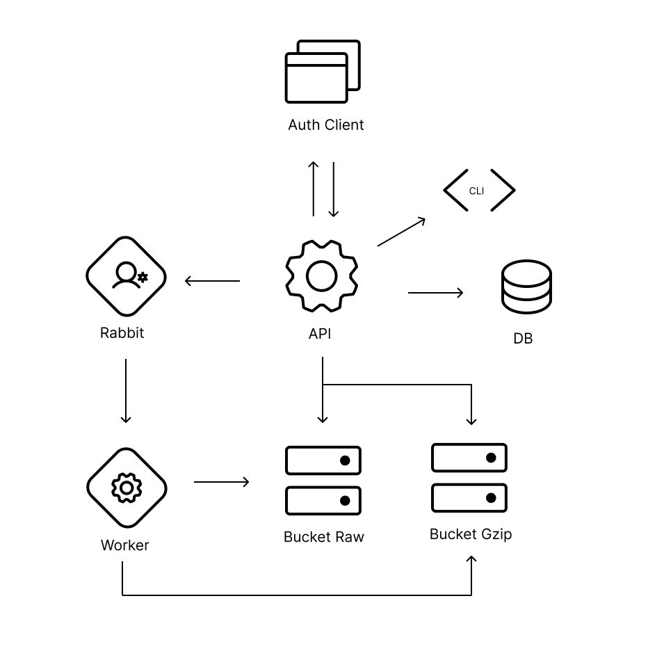

# Go Driver

## Descrição
Este é um aplicativo de armazenamento simples desenvolvido em Go. Ele oferece uma interface fácil de usar para interagir com diferentes serviços de armazenamento em nuvem.


## Arquitetura de software
<p align="center" margin-top="25px" >
  
</p> 

## Funcionalidades Principais
- **Suporte Multiplataforma:** Compatível com diversos provedores de armazenamento em nuvem.
- **Operações Básicas:** Possibilidade de realizar operações básicas de armazenamento, como upload, download, compactação, listagem e exclusão de arquivos.
- **Configuração Flexível:** Configuração fácil e flexível para conectar-se aos serviços de armazenamento desejados.

## Pré-requisitos
- Go 1.18 ou superior instalado em seu sistema.
- Credenciais válidas para o serviço de armazenamento em nuvem que deseja utilizar.

## Instalação
```bash
# Clone do repositório
$ git clone git@github.com:RobsonFeitosa/go-driver.git

# Acesso ao projeto pelo terminal
$ cd go-driver 
 
# Executando aplicação 
$ go run cmd/api/main.go

# Executando worker
$ go run cmd/api/worker.go
``` 

## Comandos úteis
```bash
# Criar usuário
$ go run cmd/cli/main.go users create --name nome --login nome@exemplo.com --pass 1234567 

# Autenticação
$ go run cmd/cli/main.go auth create --user nome@exemplo.com --pass 1234567

# Upload de imagem
$ go run cmd/cli/main.go files upload --filename ./internal/files/testdata/testeimg.jpg
``` 
